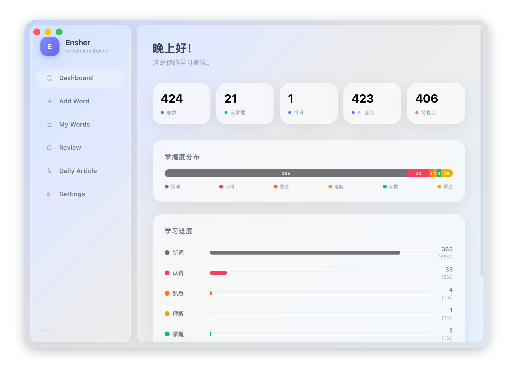
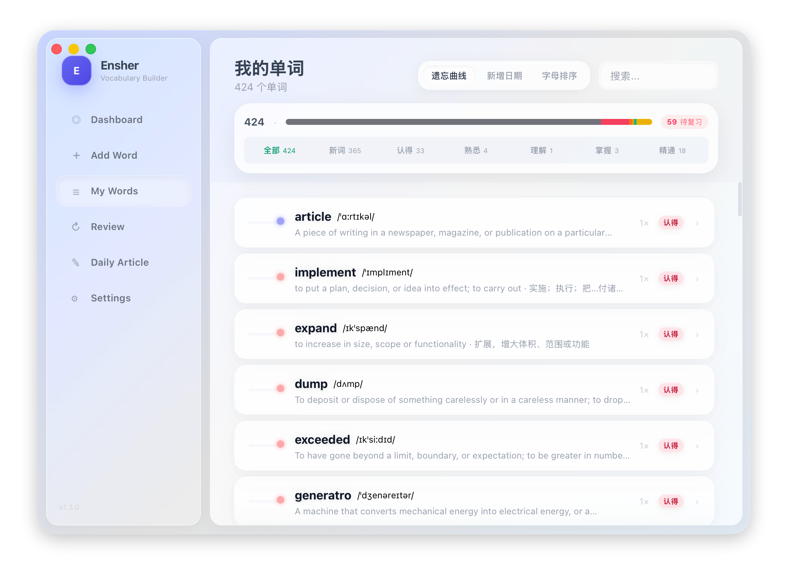
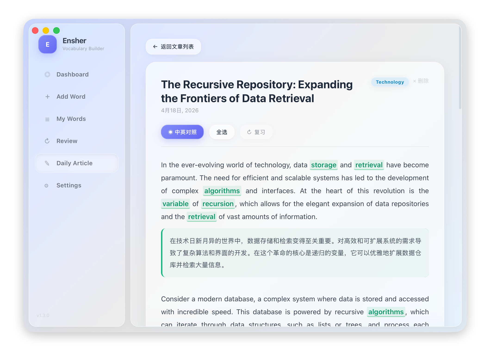
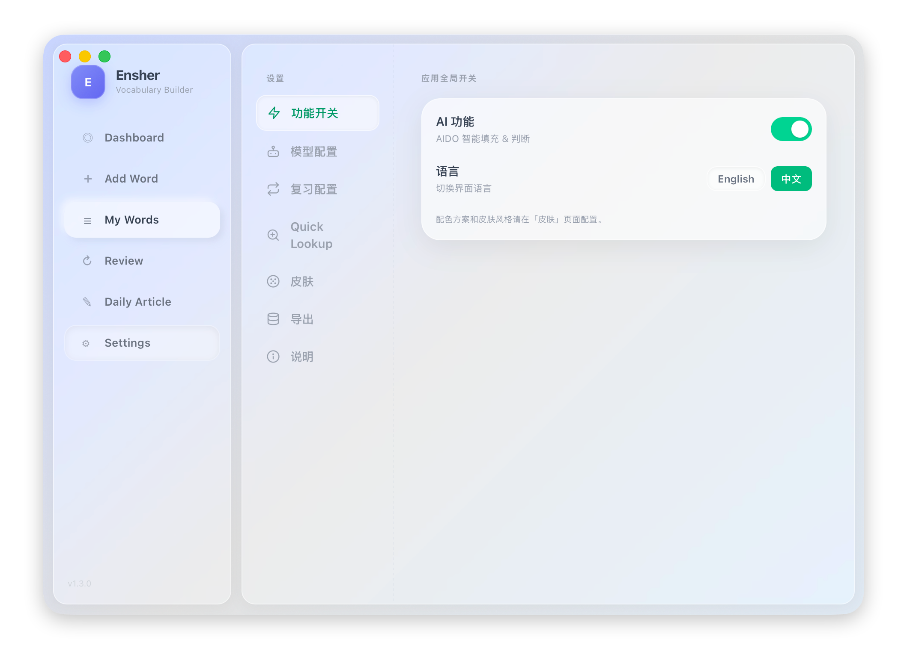

# Ensher — Vocabulary Builder

A macOS desktop app for daily English vocabulary learning with spaced-repetition review and AI-powered features.

<p align="center">
  
</p>

[English](#english) · [中文](#中文)

---

## English

### Features

- **Dashboard** — Learning overview with total words, mastered count, today's additions, mastery distribution, and learning progress chart. Click any word to see detailed popup with AI-powered etymology, roots, memory tips and related words.

  

- **Add Word** — Manually add vocabulary or auto-fill via AI. Press Enter or click AIDO to get phonetic, English/Chinese definitions, and example sentences instantly.

- **My Words** — Browse all words with letter sidebar, mastery filter tabs, Ebbinghaus curve urgency indicators, and multiple sort options (Ebbinghaus / Date / Alphabetical). AI-Learn provides deep analysis for each word.

  

- **Daily Review** — Spaced-repetition quiz with spelling practice and recognition modes. AIDO Smart Judge evaluates your Chinese understanding and gives instant feedback. Daily review limit is configurable.

  

- **Daily Article** — AI-generated English articles with highlighted vocabulary words. Supports bilingual (Chinese/English) reading. Select words from articles to create custom review sessions.

   

- **i18n** — One-click UI language switching between English and Chinese. Language preference persists across sessions.

- **Multiple Skins** — Choose from Neumorphic, Newspaper Art, or Crystal Frosted glass skin styles with light/dark theme support. Live preview in Settings.

  

- **Settings** — AI feature toggle, language switch, model configuration, daily review limit, global hotkey for Quick Lookup, and data import/export.

  

### Requirements

- macOS (Apple Silicon or Intel)
- Go 1.23+
- Node.js 18+ (for frontend build)
- [Wails v3](https://v3.wails.io/)

### Setup

```bash
# Install Wails CLI
go install github.com/wailsapp/wails/v3/cmd/wails3@latest

# Install frontend dependencies
cd frontend && npm install && cd ..

# Dev mode (hot reload)
wails3 dev

# Build production binary
wails3 build
```

The binary is output to `bin/ensher`. Run it directly:

```bash
./bin/ensher
```

### AI Configuration

1. Open **Settings** in the app
2. Enable **AI Feature** toggle
3. Choose provider (MiniMax / OpenAI / Zhipu GLM / DeepSeek / ...)
4. Paste your API key and model name
5. Save

AI features require an API key:
- **MiniMax**: [platform.minimaxi.com](https://platform.minimaxi.com) → API Keys
- **OpenAI**: [platform.openai.com](https://platform.openai.com) → API Keys

> 🚀 **Recommended MiniMax Token Plan** — 10% off: [Get it now](https://platform.minimaxi.com/subscribe/token-plan?code=HF7kOLoTjA&source=link)

### Architecture

```
ensher/
├── main.go              # Entry point, window config, service registration
├── wordservice.go       # WordService: CRUD, quiz, stats (SQLite)
├── articleservice.go    # ArticleService: AI article generation
├── aiservice.go         # AI: word lookup + judgment
├── frontend/
│   ├── src/
│   │   ├── App.jsx              # Layout + AIContext + LangContext
│   │   ├── i18n.js              # i18n translations (EN/ZH)
│   │   └── components/          # Dashboard, AddWord, WordList, Quiz, DailyArticle, Settings
│   ├── bindings/                # Auto-generated Wails bindings (gitignored)
│   └── public/style.css         # Neumorphic + Glass design system
└── build/config.yml             # App metadata
```

### Keyboard Shortcuts

| Action | Shortcut |
|--------|----------|
| AI auto-fill word | `Enter` on word field |
| Quick Lookup (global) | Configurable in Settings |

---

## 中文

### 功能介绍

- **仪表盘** — 学习概览，展示总词数、已掌握、今日新增、掌握度分布和进度图表。点击任意单词可查看详细信息，包括 AI 词源、词根拆解、记忆技巧和同根词汇。

  

- **添加单词** — 手动添加词汇或 AI 自动填充。按 Enter 或点击 AIDO 即可自动获取音标、英文/中文释义和例句。

- **我的单词** — 浏览所有单词，支持字母侧栏、掌握度筛选、艾宾浩斯遗忘曲线紧急度指示器，多种排序方式（遗忘曲线 / 日期 / 字母）。AI-Learn 提供深度学习分析。

  

- **每日复习** — 基于间隔重复的测验，支持拼写练习和认知模式。AIDO 智能判断评估你的中文理解并即时反馈。每日复习上限可配置。

  

- **每日文章** — AI 生成英语文章，高亮词汇。支持中英对照阅读。从文章中选择词汇创建自定义复习。

   

- **中英文切换** — 一键切换界面语言，支持中文和英文。语言偏好跨会话持久化。

- **多种皮肤** — 拟物风、报纸艺术、晶透磨砂三种风格，支持浅色/深色主题。设置页实时预览。

  

- **设置** — AI 功能开关、语言切换、模型配置、每日复习上限、全局快捷键查词、数据导入导出。

  

### 环境要求

- macOS（Apple Silicon 或 Intel）
- Go 1.23+
- Node.js 18+（用于前端构建）
- [Wails v3](https://v3.wails.io/)

### 安装运行

```bash
# 安装 Wails CLI
go install github.com/wailsapp/wails/v3/cmd/wails3@latest

# 安装前端依赖
cd frontend && npm install && cd ..

# 开发模式（热重载）
wails3 dev

# 构建生产版本
wails3 build
```

编译产物位于 `bin/ensher`，直接运行即可：

```bash
./bin/ensher
```

### AI 配置

1. 在应用内打开 **Settings**
2. 开启 **AI Feature** 开关
3. 选择 AI 提供商（MiniMax / OpenAI / 智谱 GLM / DeepSeek / ...）
4. 填入 API Key 和模型名称
5. 保存

获取 API Key：
- **MiniMax**: [platform.minimaxi.com](https://platform.minimaxi.com) → API Keys
- **OpenAI**: [platform.openai.com](https://platform.openai.com) → API Keys

> 🚀 **推荐 MiniMax Token Plan** — 9折专属优惠：[立即购买](https://platform.minimaxi.com/subscribe/token-plan?code=HF7kOLoTjA&source=link)

### 项目结构

```
ensher/
├── main.go              # 入口、窗口配置、服务注册
├── wordservice.go       # 单词服务：增删改查、测试、统计（SQLite）
├── articleservice.go    # 文章服务：AI 文章生成
├── aiservice.go         # AI 服务：查词 + 判断
├── frontend/
│   ├── src/
│   │   ├── App.jsx              # 布局 + AIContext + LangContext
│   │   ├── i18n.js              # 国际化翻译（中/英）
│   │   └── components/          # Dashboard、AddWord、WordList、Quiz、DailyArticle、Settings
│   ├── bindings/                # Wails 自动生成的绑定（不提交到 Git）
│   └── public/style.css         # 拟物 + 磨砂设计系统
└── build/config.yml             # 应用元数据
```

### 快捷键

| 操作 | 快捷键 |
|------|--------|
| AI 自动填充 | 在单词输入框按 `Enter` |
| 全局快速查词 | 在设置中自定义 |

---

## License

MIT
