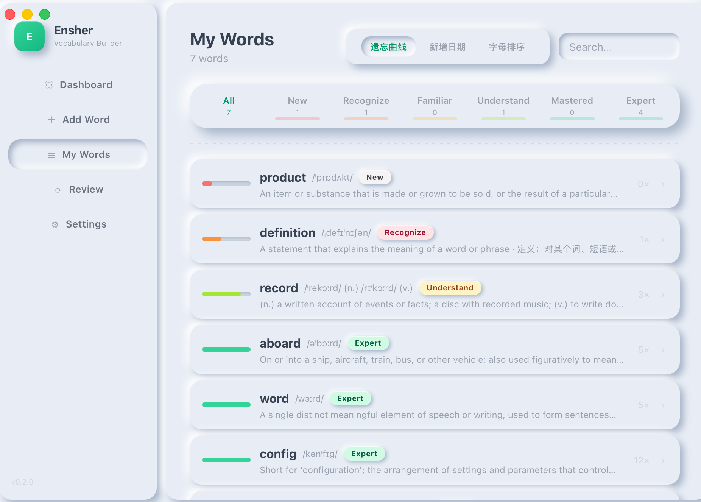
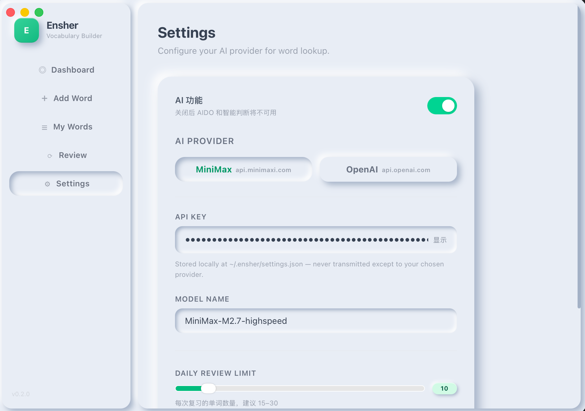

# Ensher — Vocabulary Builder

A macOS desktop app for daily English vocabulary learning with spaced-repetition review and AI-powered features.





[English](#english) · [中文](#中文)

---

## English

### Features

- **Add Words** — Manually or auto-fill via AI (MiniMax/OpenAI)
- **Daily Review** — Spaced-repetition quiz based on Ebbinghaus forgetting curve
- **AI Judgment** — After answering, type your Chinese understanding; AI judges correctness and gives feedback
- **Progress Dashboard** — Track total words, mastered count, and today's additions
- **Bilingual** — Definitions in both English and Chinese

### Requirements

- macOS (Apple Silicon or Intel)
- Go 1.23+
- Node.js 18+ (for frontend build)
- [Wails v3](https://v3.wails.io/)

### Setup

```bash
# Install Wails CLI
go install github.com/wailsapp/wails/v3/cmd/wails3@latest

# Install frontend dependencies
cd frontend && npm install && cd ..

# Dev mode (hot reload)
wails3 dev

# Build production binary
wails3 build
```

The binary is output to `bin/ensher`. Run it directly:

```bash
./bin/ensher
```

### AI Configuration

1. Open **Settings** in the app
2. Enable **AI 功能** toggle
3. Choose provider (MiniMax / OpenAI)
4. Paste your API key and model name
5. Save

AI features require an API key:
- **MiniMax**: [platform.minimaxi.com](https://platform.minimaxi.com) → API Keys
- **OpenAI**: [platform.openai.com](https://platform.openai.com) → API Keys

### Architecture

```
ensher/
├── main.go           # Entry point, window config, service registration
├── wordservice.go    # WordService: CRUD, quiz, stats (SQLite)
├── aiservice.go      # AI: word lookup + judgment (MiniMax/OpenAI)
├── frontend/
│   ├── src/
│   │   ├── App.jsx           # Layout + AIContext
│   │   └── components/       # Dashboard, AddWord, WordList, Quiz, Settings
│   ├── bindings/              # Auto-generated Wails bindings (gitignored)
│   └── public/style.css      # Neumorphic design system
└── build/config.yml          # App metadata
```

### Keyboard Shortcuts

| Action | Shortcut |
|--------|----------|
| AI auto-fill word | `Enter` on word field |

---

## 中文

### 功能介绍

- **添加单词** — 手动添加或 AI 自动填充释义（支持 MiniMax / OpenAI）
- **每日复习** — 基于艾宾浩斯遗忘曲线的间隔重复测试
- **AI 智能判断** — 回答后输入中文理解，AI 判断正误并给出学习建议
- **进度仪表盘** — 查看总词数、已掌握数、今日新增
- **双语释义** — 同时显示英文和中文解释

### 环境要求

- macOS（Apple Silicon 或 Intel）
- Go 1.23+
- Node.js 18+（用于前端构建）
- [Wails v3](https://v3.wails.io/)

### 安装运行

```bash
# 安装 Wails CLI
go install github.com/wailsapp/wails/v3/cmd/wails3@latest

# 安装前端依赖
cd frontend && npm install && cd ..

# 开发模式（热重载）
wails3 dev

# 构建生产版本
wails3 build
```

编译产物位于 `bin/ensher`，直接运行即可：

```bash
./bin/ensher
```

### AI 配置

1. 在应用内打开 **Settings**
2. 开启 **AI 功能** 开关
3. 选择 AI 提供商（MiniMax / OpenAI）
4. 填入 API Key 和模型名称
5. 保存

获取 API Key：
- **MiniMax**: [platform.minimaxi.com](https://platform.minimaxi.com) → API Keys
- **OpenAI**: [platform.openai.com](https://platform.openai.com) → API Keys

### 项目结构

```
ensher/
├── main.go           # 入口、窗口配置、服务注册
├── wordservice.go    # 单词服务：增删改查、测试、统计（SQLite）
├── aiservice.go      # AI 服务：查词 + 判断（MiniMax/OpenAI）
├── frontend/
│   ├── src/
│   │   ├── App.jsx           # 布局 + AIContext
│   │   └── components/       # Dashboard、AddWord、WordList、Quiz、Settings
│   ├── bindings/             # Wails 自动生成的绑定（不提交到 Git）
│   └── public/style.css     # 新拟态设计系统
└── build/config.yml          # 应用元数据
```

### 快捷键

| 操作 | 快捷键 |
|------|--------|
| AI 自动填充 | 在单词输入框按 `Enter` |

---

## License

MIT
